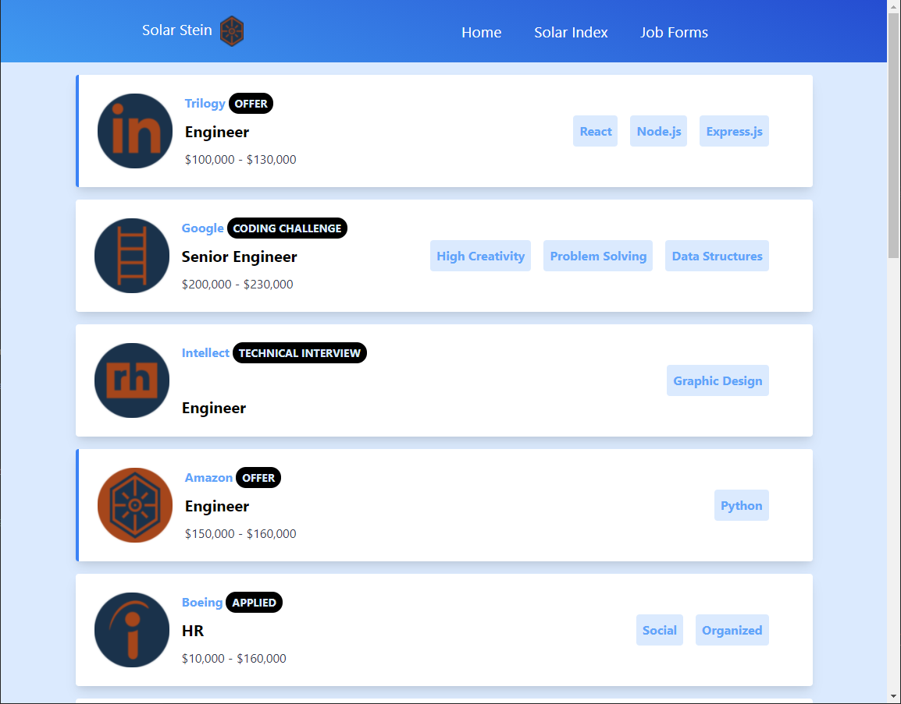
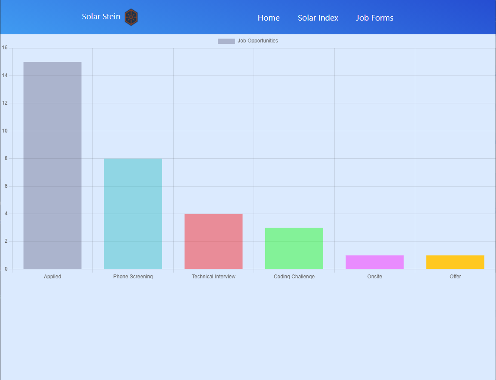

# Solar Stein

## Description

The perfect job assistant site solving the issue of managing a person's job applications.  Keep organized and track your job applications all in one place.

## Table of Contents 

* [Website](#Website)

* [Usage](#Usage)

* [License](#License)

* [Repository](#Repository)

* [Questions](#Questions)

## Website:

[http://solarstein.io/](http://solarstein.io/)

[https://solarstein.herokuapp.com/](https://solarstein.herokuapp.com/)

## Usage

The following images show the web application's appearance and functionality: 

## License:

This app is licensed under the MIT license.

## Repository:

[https://github.com/erictn3/Solar_Stein/tree/dev](https://github.com/erictn3/Solar_Stein/tree/dev)

## CONTRIBUTIONS

- [Brett's Github](https://github.com/mirewolf)
- [Eric's Github](https://github.com/erictn3)
- [John's Github](https://github.com/jrdrenth)
